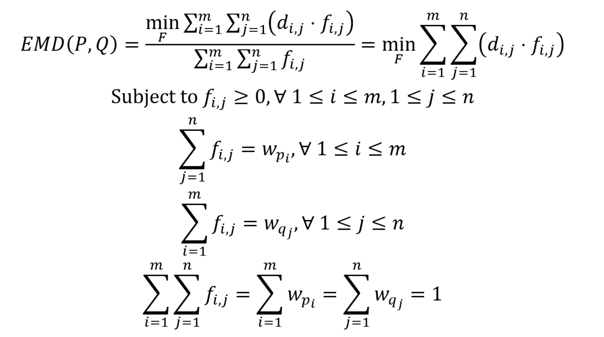

# Calculating Pairwise Similarity of Polymer Ensembles via Earth Mover’s Distance


This repository supports the following manuscript, which has been published on [*ACS Polymers Au*](https://doi.org/10.1021/acspolymersau.3c00029).

Jiale Shi, Dylan J. Walsh, Weizhong Zou, Nathan J. Rebello, Michael E. Deagen, Katharina A. Fransen, Xian Gao, Bradley D. Olsen, Debra J. Audus (2023), "Calculating Pairwise Similarity of Polymer Ensembles via Earth Mover’s Distance", *ACS Polymers Au*, 2024. [Link](https://doi.org/10.1021/acspolymersau.3c00029)

In this work, we proposed the [earth mover’s distance (EMD)](https://en.wikipedia.org/wiki/Earth_mover%27s_distance) method to quantitatively calculate the pairwise similarity score for polymer ensembles.



One polymer ensemble is defined as $P = \{(p_1,w_{p_1}) ,(p_2,w_{p_2}),...,(p_i,w_{p_i}),...,(p_m,w_{p_m})\}$ has $m$ types of polymer chains, where $p_i$ represents a type of polymer chain and  $w_{p_i}>0$ is its corresponding weight, which can be the mole fraction of this polymer chain in the polymer ensemble. Similarly, the second ensemble $Q = {(q_1,w_{q_1}),(q_2,w_{q_2}),...,(q_j,w_{q_j}),...,(q_n,w_{q_n})}$ has $n$ types of polymer chains. The sums of the weights for $P$ and $Q$ are both normalized and equal to one.


The distance ($d_{i,j}$) between one polymer molecule $p_i$ and another polymer molecule $q_j$ is calculated through graph edit distance. This part of the code builds on [GLAMOUR](https://github.com/learningmatter-mit/GLAMOUR) and networkx function [graph_edit_distance](https://networkx.org/documentation/stable/reference/algorithms/generated/networkx.algorithms.similarity.graph_edit_distance.html).

$d(g_1, g_2) = 1- \exp(-\frac{\alpha \cdot GED(g_1, g_2)}{(N_1 + N_2)/2})$

where $g_i$ is the graph representation of one polymer molecule, $N_i$ is the number of nodes in graph $g_i$, $\alpha$ is a tunable parameter with the default value being 1. [Reference1](https://arxiv.org/abs/1808.05689), [Reference2](https://doi.org/10.1021/acs.macromol.3c00761)

$f_{i,j}$ is the flow or amount of weight at $p_i$ which is transported to $q_j$, and $F=[f_{i,j} ]$ denotes all the flows between $P$ and $Q$. Here,  $d_{i,j} \cdot f_{i,j}$ is the cost for each individual flow. 

Once $EMD (P,Q)$ is calculated, the similarity score between $P$ and $Q$ is

$S(P,Q) = 1- EMD (P,Q)$


The repository is intended for the following use cases:

- Illustrate the EMD method for polymer ensemble similarity calculation in the manuscript
- Allow for full reproducibility of the results in the manuscript


## Running the code

### Running notebooks in Google Colab

If you are interested in running one or more notebooks in [Google Colab](https://colab.research.google.com/), first, click on the relevant links below.

* [Example1_Two_Component_Polymer_Ensemble](./notebooks/Example1_Two_Component_Polymer_Ensemble_Colab.ipynb)
* [Example2_First_order_Markov_Copolymer_Ensemble_onehot](./notebooks/Example2_First_order_Markov_Copolymer_Ensemble_onehot_Colab.ipynb)
* [Example2_First_order_Markov_Copolymer_Ensemble_fp](./notebooks/Example2_First_order_Markov_Copolymer_Ensemble_fp_Colab.ipynb)
* [Example3_Nonlinear_Star_Polymer_Ensemble](./notebooks/Example3_Nonlinear_Star_Polymer_Ensemble_Colab.ipynb)
* [Example4_Polymer_Ensembles_Represented_by_Experimental_Molecular_Mass_Distributions](./notebooks/Example4_Polymer_Ensembles_Represented_by_Experimental_Molecular_Mass_Distributions_Colab.ipynb)
* [Example4_Polymer_Ensembles_Represented_by_Experimental_Molecular_Mass_Distributions_Sampling_Frequency_Convergence_Test](./notebooks/Example4_Polymer_Ensembles_Represented_by_Experimental_Molecular_Mass_Distributions_Sampling_Frequency_Convergence_Test.ipynb)


Then, click on the Colab badge  in the notebook.

It will open a Colab notebook. Then, you can run the notebook as normal. All the required libraries and functions are present in the Colab notebook. 
If you cannot successfully open the Colab badge, download the notebook and upload it to Google Colab.


## Contact

Jiale Shi, PhD  

Postdoctoral Associate  

Department of Chemical Engineering 

Massachusetts Institute of Technology (MIT) 

Email: jialeshi@mit.edu  

GithubID: shijiale0609  
 

## How to cite

If you use the code, please cite our paper on *ACS Polymers Au*.

```
@article{shi2023calculating,
author = {Shi, Jiale  and Walsh, Dylan and Zou, Weizhong and Rebello, Nathan J. and Deagen, Michael E. and Fransen, Katharina A. and Gao, Xian and Olsen, Bradley D. and Audus, Debra J. },
title = {Calculating Pairwise Similarity of Polymer Ensembles via Earth Mover’s Distance},
journal = {ACS Polymers Au},
year = {2024},
doi = {10.1021/acspolymersau.3c00029},
URL = {https://doi.org/10.1021/acspolymersau.3c00029} 
}
```
[Preprint version on ChemRxiv](https://doi.org/10.26434/chemrxiv-2023-qcjkh) is also available.
